# React Native Mental Health App with Stream Chat & Video Call

CampusBridge adalah aplikasi mobile berbasis React Native yang dirancang untuk mempermudah proses bimbingan skripsi antara mahasiswa dan dosen. Aplikasi ini dilengkapi dengan fitur chat real-time, video call konsultasi, penjadwalan bimbingan, dan pemantauan progres skripsi secara efisien.

Proyek ini memanfaatkan Stream sebagai infrastruktur utama untuk komunikasi, serta berbagai tools modern untuk membangun UI yang responsif dan performa tinggi.

Manfaat Aplikasi

- Meningkatkan efisiensi komunikasi akademik
- Memudahkan penjadwalan dan dokumentasi bimbingan
- Mendukung pembelajaran jarak jauh secara real-time

Fitur Utama

- Chat real-time antara mahasiswa dan dosen
- Grup chat untuk komunitas mahasiswa
- Histori chat and thread diskusi
- Banyak reaksi dan attachment tambahan di dalam chat
- Indikator terakhir online dan aktivitas chat
- Perekaman sesi video bimbingan dan transkripsi otomatis

Teknologi yang digunakan:

- [Expo Router](https://docs.expo.dev/routing/introduction/) file-based navigation
- [Stream Chat](https://getstream.io/chat/docs/react-native/) untuk chat
- [Stream Video](https://getstream.io/video/docs/react-native/) untuk video call
- [Stream Moderation](https://getstream.io/moderation/docs/) untuk content moderasi
- [NativeWind](https://www.nativewind.dev/) untuk styling
- [Expo Video](https://docs.expo.dev/versions/latest/sdk/video/) untuk video playback
- [Datetime Picker](@react-native-community/datetimepicker) untuk waktu dan tanggal
- [Jotai](https://jotai.pmnd.rs/) untuk state management
- [React Hook Form](https://react-hook-form.com/) for form handling
- [Zod](https://zod.dev/) untuk schema validation
- [React Native Incall Manager](https://github.com/react-native-incall-manager/react-native-incall-manager) untuk audio handling
- [React Native Secure Store](https://github.com/react-native-securestore/react-native-securestore) untuk secure storage

### ⚡ Mulai Membuat Akun Stream

Lanjut buat akun stream terlebih dahulu untuk memulai lebih lanjut

👉 [klik disini untuk lanjut bikin akun stream](https://getstream.io/maker-account/)

---

## Instalasi

### Environment Setup

Pastikan kamu sudah menginstal:

1. Node.js
2. Expo CLI
3. Android Studio dan/atau Xcode (untuk emulator)

### App Setup

untuk build aplikasi tolong ikuti step ini

1. Clone the repository
2. Run `npm install`
3. Run `npx expo prebuild`
4. Run `npx expo run:ios` atau `npx expo run:android`

## Backend API Setup

1. Clone repo backend: (https://github.com/dimasdekka/CampusBridgeAPI)
2. Tambahkan kredensial Stream dan konfigurasi lain di file .env
3. Pastikan frontend (CampusBridge) menggunakan URL backend yang sesuai di .env
4. Run `npm install`
5. Run `npx prisma migrate deploy`
6. Run `npm run seed`
7. Run `npm run build`
8. Run `npm start`

## Demo

## App Screenshots

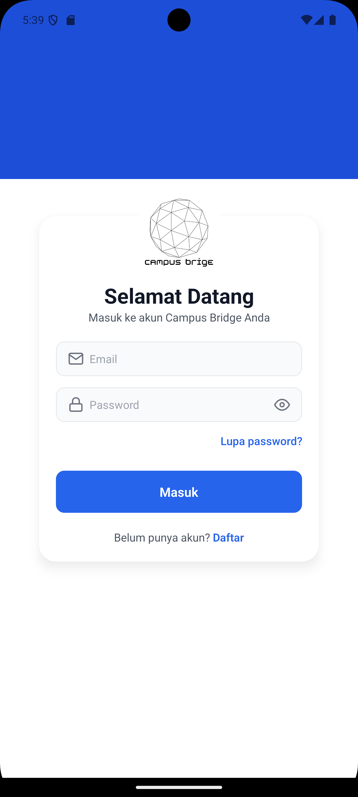
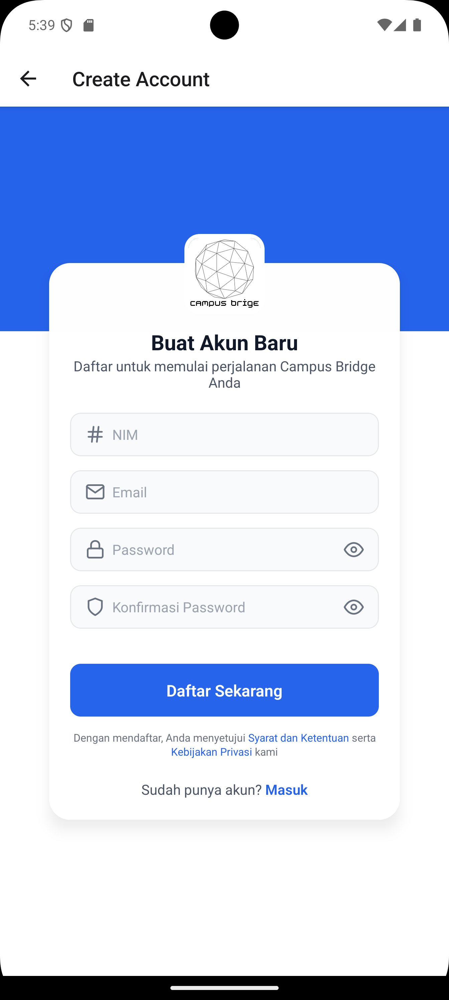
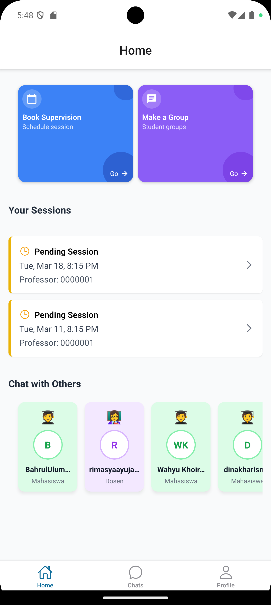
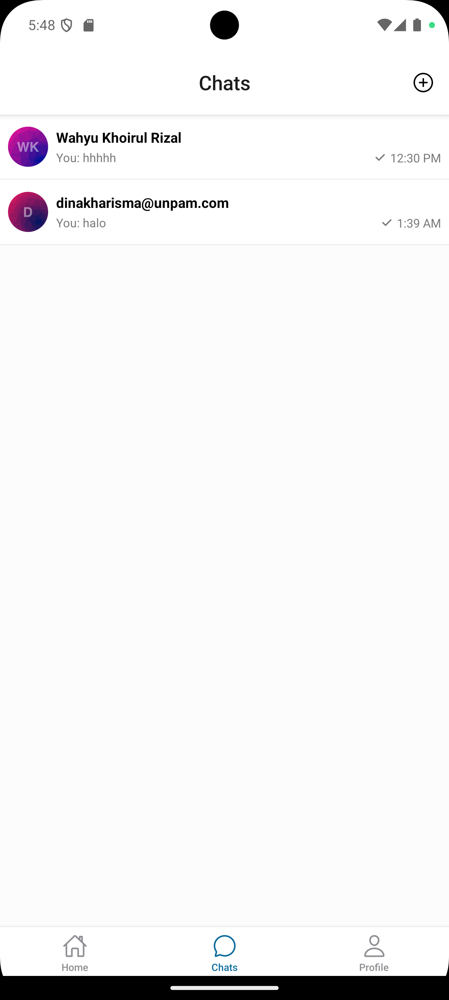
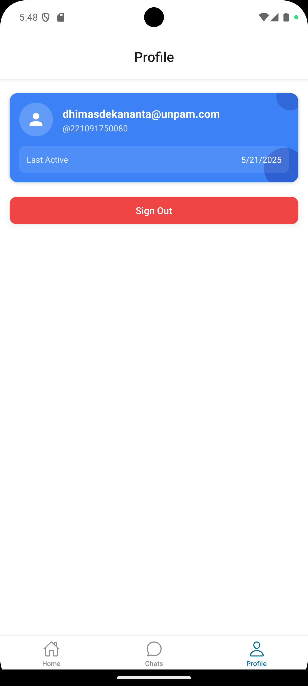
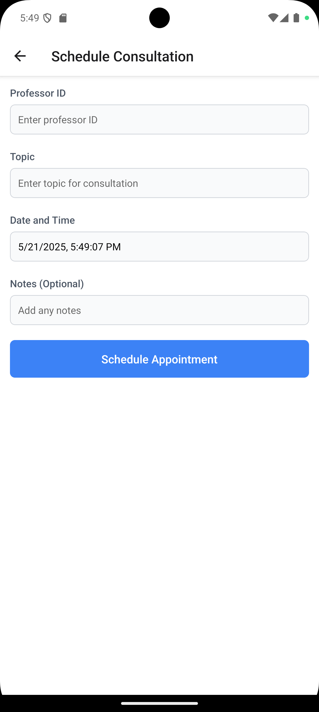
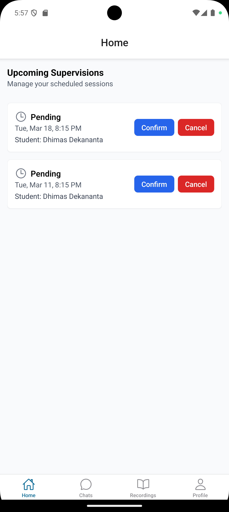

## Stream Screenshots

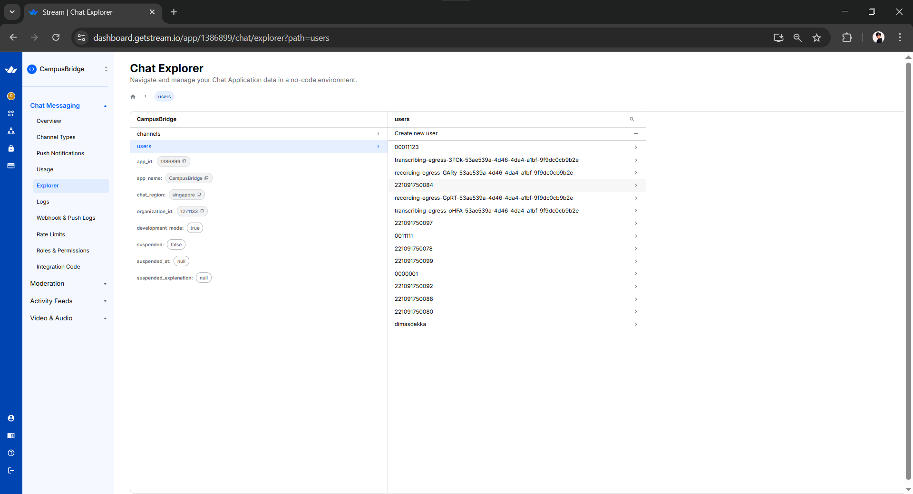
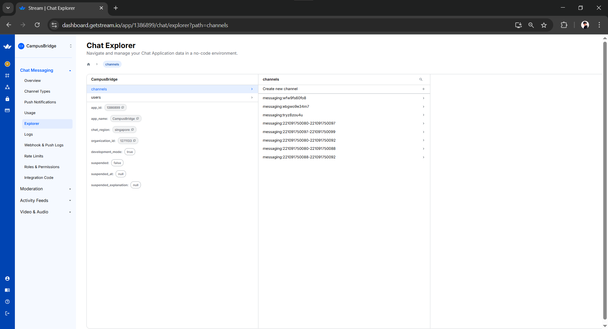
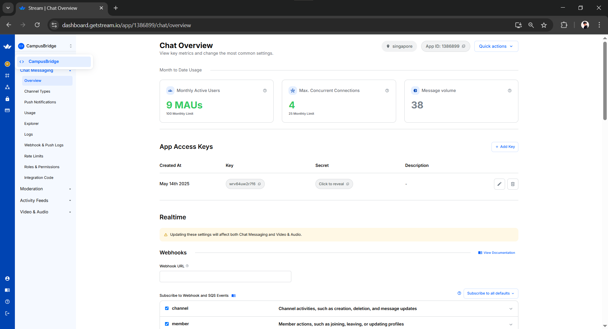
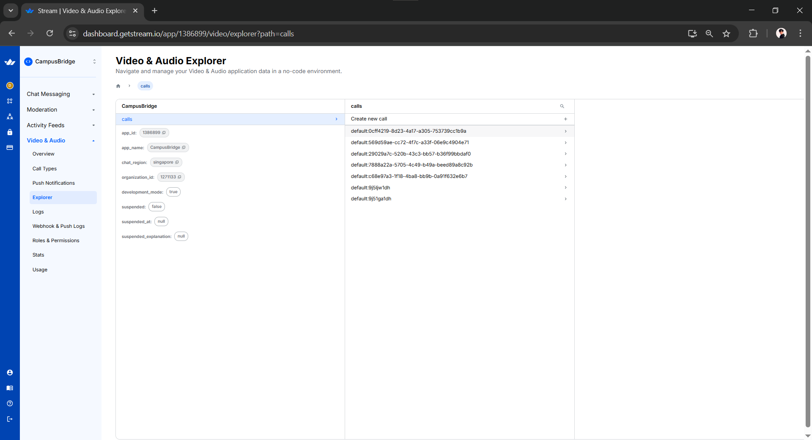

## 🚀 Lanjutan

Saya dev pengembang ingin membuat sistem mahasiswa bimbingan skripsi menjadi lebih mudah, modern, dan bebas hambatan komunikasi.
